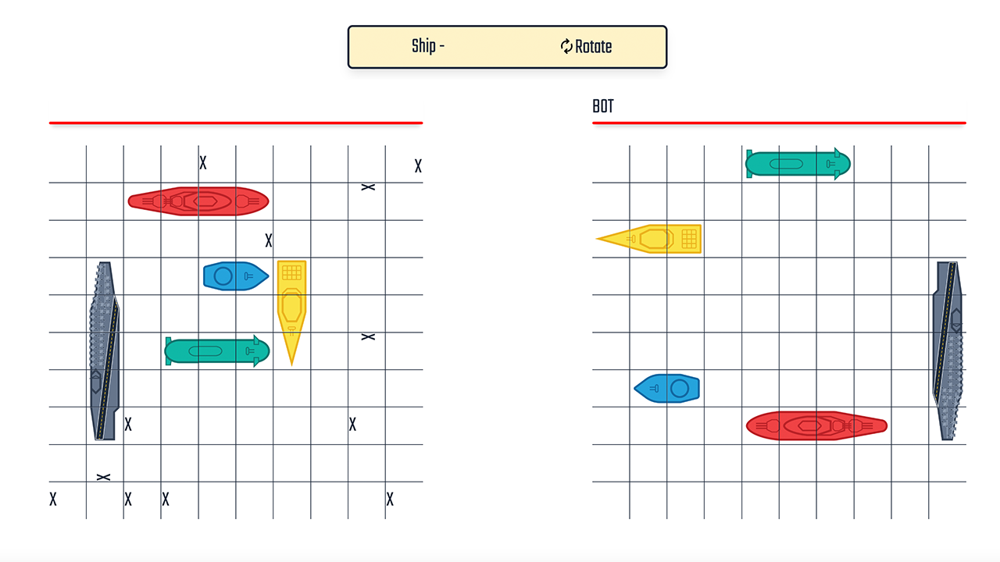

# Battleship | The Odin Project
## About _Battleship_

This was a made-from-scratch web project built in 2022 for [The Odin Project](https://www.theodinproject.com/), in which the goal is to create a battleship game with the same functionalities as the real life ones with bots and multiplayers to test our web development skills.

Current features:
* Flexible Ship Placement (in all directions)
* Unique ship designs
* Pass-n-play multiplayer [WIP]
* Singleplayer with bot difficulties [WIP]
* Mobile Responsiveness
* Detailed Information about Player and Board

## Built with
This project is made from scratch with the following language, libraries, and tools:
* 
* 
* 
* 

## Getting Started
In order to run this project in development mode, follow the instructions below:
1. Clone the repo  
```
github clone git@github.com:chheangg/battleship.git 
```
2. Install npm packages
```
npm install
```
3. Run the project in development mode
```
npm run start
```
4. Now, you can access the project at the link: ```http://localhost:8080/```

## Roadmap
- [ ] Refactor Project
- [x] Base Game Functionalities
- [ ] Refactor Coordinate, Directon, Ship Enums into objects with documentation
- [ ] Attack Mode Styling
  - [x] Fog of War
  - [x] Hovering
  - [ ] Hit
  - [ ] Miss
  - [ ] Pass-n-play delay
- [ ] Detailed Placement informations
  - [ ] Ship Icon Info
  - [ ] Direction Info
- [ ] Detailed In-Game informations
  - [ ] Healthbar
  - [ ] Ship Counter
  - [ ] Bot Indicator
- [ ] Custom bot difficulties
- [ ] Website Hosting
- [ ] Browser History Implementation
